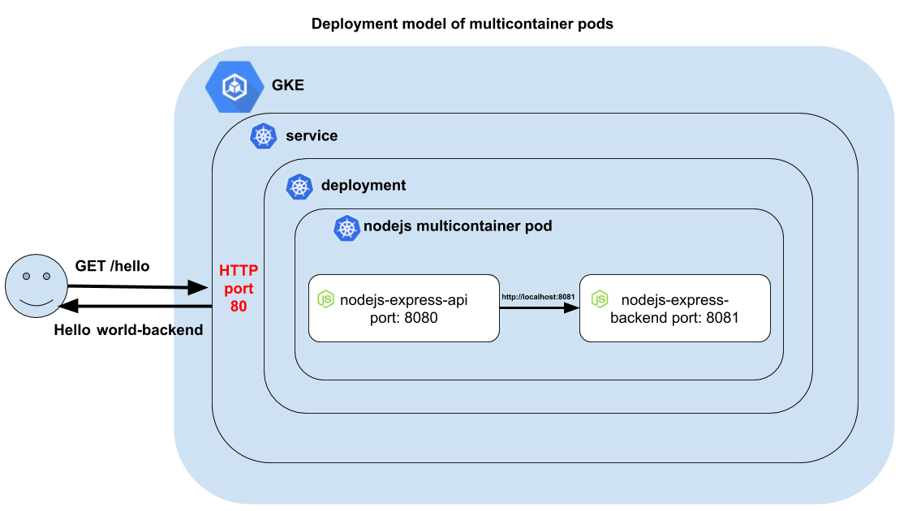

Kubernetes multicontainer NodeJS API pod on GKE
===============================================================

In this tutorial I'll be walking you through the creation of a multicontainer pod with two apps: a NodeJS REST API, and another NodeJS API that serves as the backend. Everything running in Kubernetes. And more specifically, on GKE (Google Kubernetes Engine).

This tutorial is based on the awesome [Deploying a containerized web application tutorial](https://cloud.google.com/kubernetes-engine/docs/tutorials/hello-app), which introduced me to Kubernetes. However, as I'll be leveraging multicontainer pod deployment model in future tutorials, I decided to write one with the purpose of augmenting it.




### Why do you need multicontainer pods?
There are multiple reasons for this. Allow me to elaborate my reasons.

#### TL;DR
This tutorial has two NodeJS Express HTTP containers that aim to separate responsibilites of API Management and backend (business rules):

1. **For the execution of certain API Management policies** like validate a token, apply spike arrest, apply quota restrictions, etc. E.g. in the near future, I might want to use Apigee Microgateway. Stay tuned for another tutorial on this.

2. **For the execution of the business rules** perhaps payload transformations, mashups (calling multiple APIs and consolidating responses), etc.

Let me expand on the above, as I'll build on top of this tutorial for future content.

* **To add API Management capabilities.** In my case, I'm using a plain NodeJS app, for the sake of keeping this tutorial as simple as possible and reusable. However, you can use anything more sophisticated. For instance, [Apigee Microgateway](https://docs.apigee.com/microgateway/content/edge-microgateway-home), which you can also run on Docker. Full disclosure, I work for Google Apigee, hence my familiarity with this product.
* **To add transformation/mediation capabilities without increasing the complexity of my current codebase to either API management or Transformation/mediation layers**. API Management is a separate responsibility, hence it should be separate container from transformation and mediation capabilities (another container). 
* **To leverage the same k8s cluster and pod that the REST API use.** Adding transformation/mediation NodeJS app should not increase the complexity of my infrastructure (my cluster). If the REST API and transformation/mediation NodeJS API coexist in the same pod, Kubernetes will manage the pod and keep both containers healthy without adding a separate cluster for both containers. Some purists might be against this model, but I won't into that conversation at this point.

You can run these steps in Kubernetes [GCP free-tier](https://cloud.google.com/free) for a few bucks covered by the 300 credit. I recommend running on n1-standard-1 machines, since I noticed some pods getting into errors because of the lack of running Kubernetes on small footprint hardware such as micro VMs (06 GBs) ¯\_(ツ)_/¯.

### Step 0: Clone this repo
First things first, clone this repo either on your laptop or GCP CloudShell.
```
git clone https://github.com/dzuluaga/kubernetes-multicontainer-pod-lab.git
```

**The folder structure:**
```bash
├── kubernetes_nodejs_deployment.yaml -> deployment descript
├── nodejs-express-api -> REST API
│   ├── Dockerfile
│   ├── node_modules
│   ├── package.json
│   └── server.js
└── nodejs-express-backend -> Transformation/mediation API
    ├── Dockerfile
    ├── package.json
    └── server.js
```

### Step 1: Test nodejs-express-api locally
Open one terminal window to start NodeJS Express REST API server. This API will be exposed by Kubernetes LoadBalancer component through port 80.

```bash
cd nodejs-express-api
node server.js
curl http://localhost:8080/hello -H 'Skip-Backend: true'
```
Response:
```
Hello world-API
```
Note `Skip-Backend` header will skip call to the backend.

### Step 2: Test nodejs-express-backend locally
Open another terminal window to start the server. And execute the following commands:

```bash
cd nodejs-express-backend
node server.js
curl http://localhost:8081
```
Response:
```
Hello world-backend 
```

### Step 3: Test nodejs-api calling nodejs-backend

Execute
```bash
curl http://localhost:8080/hello
```
Response:
```
Hello world-backend
```
**Note that response includes `-backend` word in it. Therefore, nodejs-api is serving as api proxy to nodejs-express-backend.**

In the next steps we will deploy a multicontainer pod with these two apps.

### Step 4: Login to console.cloud.google.com start CloudShell
Create a cluster of 3 VMs n1-standard-1 for our two node.js apps.

```
gcloud container clusters create multi-container-pod --num-nodes=3 --machine-type=n1-standard-1 --zone=us-west1-a
```

### Step 5: Set PROJECT_ID environment variable
This variable will be referenced from next steps. So, it's useful to keep it as variable instead of a hardcoded value.
```
export PROJECT_ID="$(gcloud config get-value project -q)"
```

### Step 6: Build a Docker image of nodejs-express-api
```bash
cd nodejs-express-api
docker build -t gcr.io/${PROJECT_ID}/nodejs-express-api:v1 .
```

Push Docker build to your own private [Google Container Registry in GCP](https://cloud.google.com/container-registry):
```
gcloud docker -- push gcr.io/${PROJECT_ID}/nodejs-express-api:v1
```

### Step 7: Build a Docker image of nodejs-express-backend

```
cd ../nodejs-express-backend
docker build -t gcr.io/${PROJECT_ID}/nodejs-express-backend:v1 .
```

Push Docker build to Google Container Registry:
```
gcloud docker -- push gcr.io/${PROJECT_ID}/nodejs-express-backend:v1
```

### Step 8: Create our pod
Edit `Kubernetes.yaml` and replace `$GCP_PROJECT` token with your GCP project.
```bash
$ kubectl apply -f kubernetes_nodejs_deployment.yaml
```

### Step 9: Expose port
This step will only expose port 8080 from nodejs-express-api container through standard http port 80, so it's accessible through your browser from a public IP address.

```bash
$ kubectl expose deployment multicontainer-nodejs-deployment --type=LoadBalancer --port=80 --target-port=8080
```

**Get Public IP Address**
```
$ kubectl get service
```
Response:
```
NAME                             TYPE           CLUSTER-IP     EXTERNAL-IP     PORT(S)        AGE
multicontainer-nodejs-deployment   LoadBalancer   10.35.249.82   35.230.95.143   80:32720/TCP   1m
```

### Step 10: Test access from nodejs-api to nodejs-backend
From command get the public IP address and access your nodejs-express-api using a curl command. You can use your browser.

```
$ curl 35.230.63.8/hello
```
Response:
```
Hello world-backend
```

This response validates that nodejs-api can call nodejs-backend.

### Step 11: Scale your application
You can increase the number of replicas of your app by using `kubectl scale` command. Increase 5 more replicas of your multicontainer pod.

```
$ scale deployment multicontainer-nodejs-deployment --replicas=6
deployment "multicontainer-nodejs-deployment" scaled

$ kubectl get pods
NAME                                                READY     STATUS    RESTARTS   AGE
multicontainer-nodejs-deployment-66b758855c-6h27v   2/2       Running   0          18h
multicontainer-nodejs-deployment-66b758855c-9fpx6   2/2       Running   0          18h
multicontainer-nodejs-deployment-66b758855c-kb67r   2/2       Running   0          18h
multicontainer-nodejs-deployment-66b758855c-mnpsn   2/2       Running   0          8s
multicontainer-nodejs-deployment-66b758855c-nzjjp   2/2       Running   0          8s
multicontainer-nodejs-deployment-66b758855c-tsz4h   2/2       Running   0          8s
```

### Step 12: Let me know your thoughts
I want to know your feedback! You can reach  out to me on twitter [@dzuluaga](http://www.twitter.com/dzuluaga).

### Troubleshooting

#### Bash into the container to test curl

```
$ kubectl exec -it kubernetes-multi-container-pod -- /bin/sh

or to ssh into a specific container:
kubectl exec -it kubernetes-multi-container-pod -c nodejs-express-backend -- /bin/sh
```

From here you can run requests to test connectivity:
```
$ curl http://localhost:8080/hello
Hello world-backend

To backend:
$ curl http://localhost:8081
```
Response
```
Hello world-backend
```